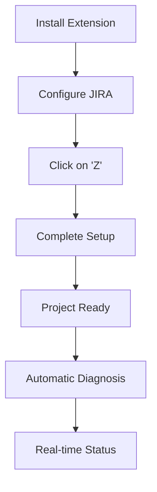

# Zazu VS Code Extension


A VS Code extension that completely automates the setup of the **Zazu AI Assistant** project, including dependency verification, repository cloning, JIRA configuration, and automatic diagnostics.

## 🎯 Specifically designed for Zazu AI Assistant

This extension is optimized to work with the [Zazu AI Assistant](https://github.com/carlosmedinainditex/zazu-ai-assistant) project, an AI assistant for Inditex JIRA queries.

## ✨ Main Features

### 🎮 Smart Context Menu
- **"Z" icon** in the status bar with context menu
- **Dynamic visual status**: ✅ OK, ⚠️ Warning, 🔥 Error, 🔄 Unknown
- **Quick access** to all main functions

### 🔧 Complete Automatic Setup
- ✅ **Dependency verification** (Python3, pip3, git)
- ✅ **Smart cloning** with 3 location modes
- ✅ **Automatic installation** of Python dependencies
- ✅ **JIRA configuration** with visual interface
- ✅ **Automatic configuration** of GitHub Copilot instructions
- ✅ **JIRA connection diagnostics** in real time

### 📁 Flexible Cloning Modes

| Mode | Description | Ideal for |
|------|-------------|------------|
| `current-folder` | Clone in current directory | Existing projects |
| `subfolder` | Create `zazu-ai-assistant` subfolder | **Recommended** |
| `custom-path` | Custom path | Specific locations |

## 🚀 Quick Usage

### 1️⃣ Installation
```bash
# Install from VSIX file
code --install-extension zazu-project-setup-0.1.0.vsix
```

### 2️⃣ Visual Configuration
1. **Cmd/Ctrl + ,** → Search "Zazu"
2. **Configure JIRA**: Server, User, Token
3. **Select cloning mode**

### 3️⃣ Automatic Setup
- **Click on "Z"** in the status bar
- **Select "🚀 Complete Setup"**
- Ready! 🎉

## 📋 Available Commands

| Command | Description | Shortcut |
|---------|-------------|----------|
| `Zazu: Setup Project` | Complete automatic setup | Cmd+Shift+P |
| `Zazu: Check Dependencies` | Verify system dependencies | - |
| `Zazu: Clone Repository` | Clone repository | - |
| `Zazu: Configure Environment` | Configure JIRA variables | - |
| `Zazu: Run Diagnosis` | Test JIRA connection | - |
| `Zazu: Show Status Menu` | Context menu | Click on "Z" |
| `Zazu: Open Settings` | Open configuration | - |

## ⚙️ Configuration

### 📁 Project Configuration
```json
{
  "zazu.repositoryUrl": "https://github.com/carlosmedinainditex/zazu-ai-assistant.git",
  "zazu.cloneMode": "subfolder",
  "zazu.projectPath": "${workspaceFolder}"
}
```

### 🔐 JIRA Configuration
```json
{
  "zazu.env.jiraServer": "https://jira.inditex.com/jira",
  "zazu.env.jiraUser": "your-username",
  "zazu.env.jiraToken": "your-bearer-token",
  "zazu.env.maxResults": 50,
  "zazu.env.defaultJql": "project in (IOPCOMPRAS, IOPSOFT) AND issuetype = \"Initiative\" ORDER BY updated DESC"
}
```

### 🤖 Automation
```json
{
  "zazu.autoSetup": false  // Disabled by default to not interfere with VS Code
}
```

## 🎨 Visual Interface

### 📊 Status Indicator (Bottom bar)
```
Z  ← Click to open menu
```

### 🎮 Context Menu
```
✅ Everything OK - JIRA connected
─────────────────────────
🔧 Open Configuration
🩺 Run Diagnosis  
📋 View Detailed Status
🚀 Complete Setup
─────────────────────────
❌ Close
```

## 🧠 GitHub Copilot Auto-Setup

The extension **automatically configures** GitHub Copilot instructions:

```
.github/copilot-instructions.md  →  copilot-instructions.md (root)
.github/prompts/*.md             →  .copilot/*.md
```

**GitHub Copilot works immediately** with project instructions! 🎯

## 🔄 Optimized Workflow



## 📦 Final Structure

```
zazu-vsc-plugin/
├── src/extension.ts              # Main code (single file)
├── out/extension.js              # Compiled (169.5kb)
├── package.json                  # Essential configuration
├── LICENSE                       # MIT License (Carlos Medina)
├── README.md                     # This documentation
├── CHANGELOG.md                  # Change history
└── .vscode/                      # Development configuration
```

## 🛠️ Development

### System Requirements
- **Python 3.x** + pip3
- **git**
- **Node.js** + npm
- **VS Code ^1.74.0**

### Development Scripts
```bash
npm run compile     # Compile
npm run watch       # Development mode
npm run lint        # Verify code
npm run package     # Create extension
```

### Debug in VS Code
1. **F5** or "Run Extension"
2. New window with extension loaded
3. Test functionalities

## 🔒 Security and Privacy

- ✅ **Does not store credentials** in source code
- ✅ **Secure configuration** through VS Code Settings
- ✅ **Only accesses** configured project files
- ✅ **MIT License** - Open source

## 🐛 Troubleshooting

### "Z" doesn't appear in status bar
- Execute any Zazu command to activate the extension
- Verify that the extension is installed and enabled

### Commands don't appear in Command Palette
- **Cmd+Shift+P** → Reload Window
- Verify extension activation

### Cloning error
- Verify `repositoryUrl` and `projectPath` configuration
- Check GitHub connectivity

## 🤝 Contributing

1. **Fork** the repository
2. **Create branch**: `git checkout -b feature/new-functionality`
3. **Commit**: `git commit -am 'New functionality'`
4. **Push**: `git push origin feature/new-functionality`
5. **Pull Request**

## 📄 License

MIT License - Copyright (c) 2025 Carlos Medina

## 🎉 Enjoy your automated Zazu setup!

---

**Problems?** Open an issue with error details, VS Code version and operating system.
